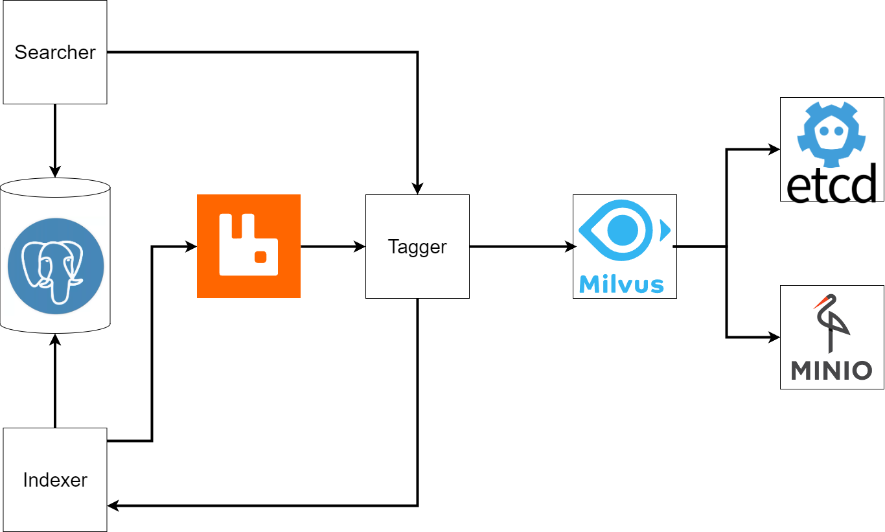

# Sadko
Проект для хакатона Лидеры цифровой трансформации. 

## Архитектура

## Сервисы:
* Indexer: [link](https://github.com/inview-team/sadko_indexer). Отвечает за получение запросов на индексацию видео , а также создание отношений между видео и векторами.
* Tagger:  [link](https://github.com/inview-team/sadko_tagger). Обрабатывает поступающие видео, пропуская их через пайплайн с моделями.
* Searcher: [link](https://github.com/inview-team/sadko_searcher). Реализует поиск видео по запросу, а также предлагает автодополнение
* Frontend: [link](https://github.com/inview-team/sadko_frontend). Перерисованная версия сайта Yappy с функциональностью поиска видео.

